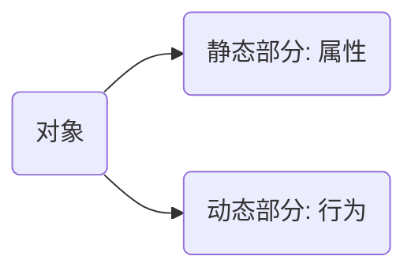
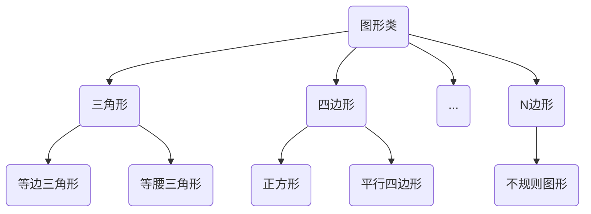

# 一. 类与对象

#### @[Toc]

[TOC]

### 1.面向对象概述

#### 1.1对象和类	

​	对象是事物存在的实体，如人类，课桌，计算机，高楼大厦等；



​		类则是对同一类事物的统称，具有相同属性和行为的一类事物就是类。

> ##### 			**更为恰当地描述是：类是世间事物的抽象称呼，而对象则是这个事物相对应的实体**:happy:

#### 1.2面向对象的特点

##### 1.封装

​		封装是面向对象编程的核心思想，将对象的属性和行为封装起来，而将对象的属性和行为封装起来的载体就是类，类通常对客户隐藏其实现细节，这就是封装的思想.

##### 2.继承

​	类与类之间同样具有关系，如一个百货大楼类与销售员类相联系，类之间的这种关系被称为关联。

​	类与类之间的关系有很多种，继承只是关联中的其中一种。



> ​													**可以说子类的实例是父亲的实例，但不能说父类的实例是子类的实例；**

##### 3.多态

​	**将父类对象应用于子类对象的特征就是多态。**

:family_man_girl: 以图形类来说明多态，每个图形都有绘制自己的能力，这个能力可以看作是该类具有的能力，如果将子类的对象统一看作是超类的实例对象，这样在绘制任何图形时，可以简单地调用父类，也就是图形类绘制图形的方法即可绘制任何图形，这就是多态的基本思想。

​	**多态的实现并不依赖具体类，而是依赖于抽象类和接口。**

​	（1）在多态的机制中，父类经常会被定义为抽象类，在抽象类中给出一个方法的标准，而不给出实现的具体流程。

​	（2）比抽象类更为方便的方式是将抽象类定义为接口，由抽象方法组成的集合就是接口。举个例子：不同厂家生产的螺丝和螺丝钉轻易的组合在一起，因为生产螺丝，和螺丝钉厂家都遵循着一个标准，这在Java语言中就是接口。

### 2.类

#### 2.1类的构造方法

```java
public book(){

			//...构造方法体

}
```

**补充：**

​    **this的使用方法**

1. this代表当前对象的一个引用。所谓当前对象，指的是调用类中方法或属性的那个对象。

   ```java
   class Person {    
   	private String name;    
   	private int age;    
   	
   	public Person(String name, int age) {    
   	*// 局部变量name,age把Person类的属性屏蔽*     
       this.name = name;     
       this.age = age;    
       }
    }
   ```

   

2. this只能在方法内部使用，表示对“调用方法的那个对象”的引用。但要注意，如果在方法内部调用同一个类的另一个方法，就不必使用this，直接调用即可。当前方法中的this引用会自动应用于同一类中的其他方法。

   ```java
   public class Apricot {
   	void pick() {}
   	void pit() {
   		pick();
   	}
   }
   ```

   

3.  this不能用于静态方法。main方法也是静态的，所以this也不能用于main方法。

4. 可以**使用this关键字调用重载构造方法**。避免相同的初始化代码，只能在构造方法中用，并且**必须位于构造方法的第一句**。并且，除了构造器之外，编译器禁止在其他任何方法中调用构造器。

   ```java
   package this_constructor;
   class Person {
   	String name;
   	int age;
   	public Person() {
   		System.out.println("Person() constructor!");
   	}
   	public Person(String name, int age) {
   		this();	// 调用本类中无参构造方法
   		this.name = name;
   		this.age = age;
   		System.out.println("Person(String name, int age) constructor!");
   	}
   }
   public class ThisConstructor {
   	public static void main(String[] args) {
   		{
   			new Person("小光", 25);
   		}
   	}
   }
   ```

   #### 

#### 2.2类的主方法

主方法是类的入口点。

```java
public static void main(String[] args){
    //方法体
} 
```

#### 2.3权限修饰符

​	

| 访问包位置       | private | protected | public |
| :--------------- | ------- | --------- | ------ |
| 本类             | 可见    | 可见      | 可见   |
| 同包其他类或子类 | 不可见  | 可见      | 可见   |
| 其他包的类或子类 | 不可见  | 不可见    | 可见   |

